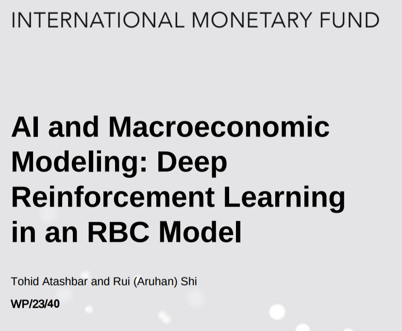
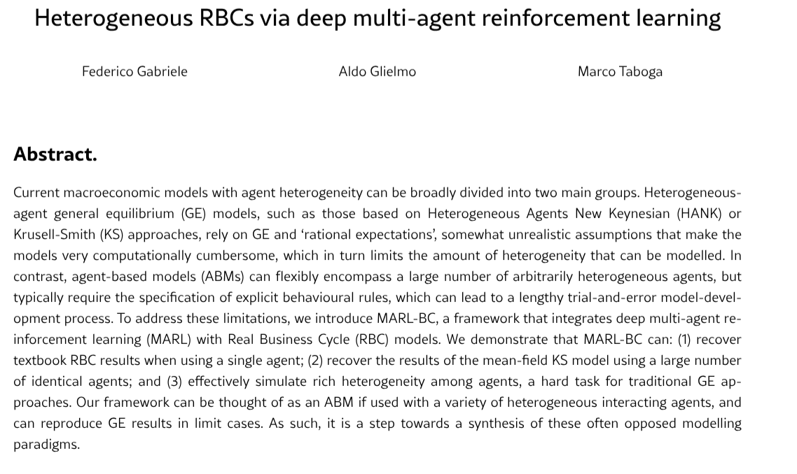
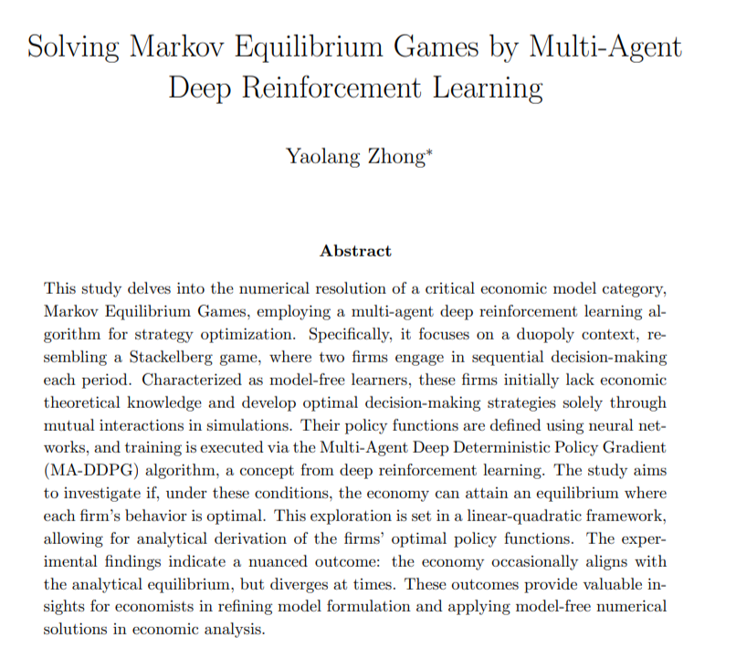
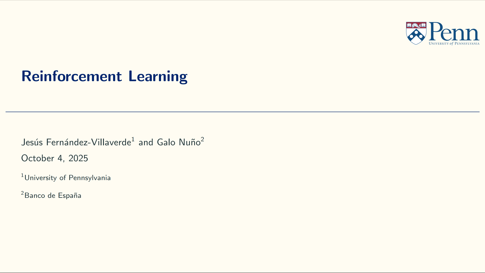
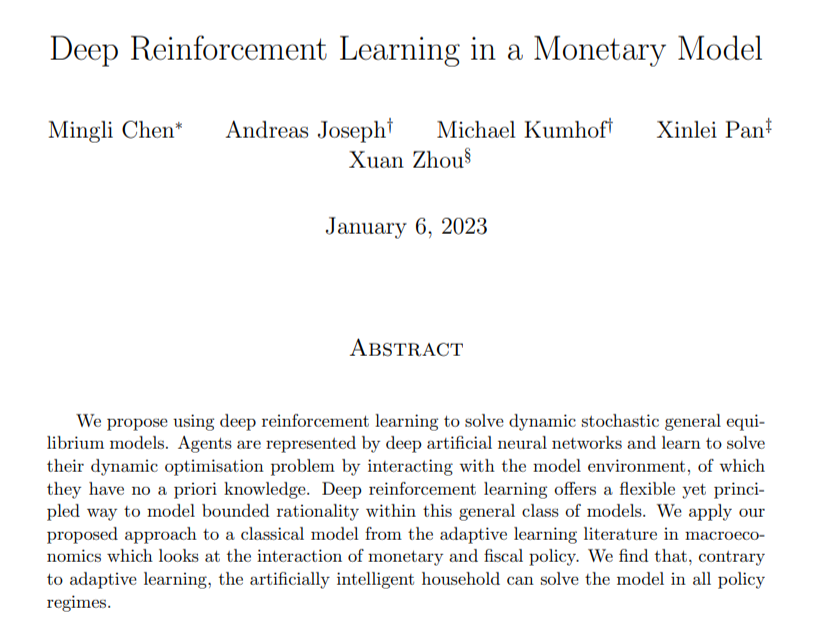
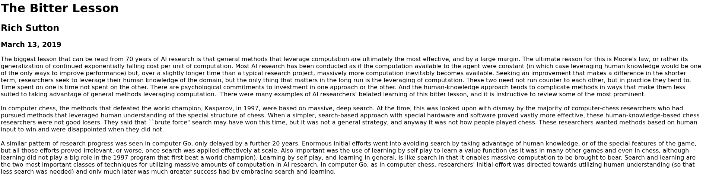

---
# try also 'default' to start simple
theme: seriph
# random image from a curated Unsplash collection by Anthony
# like them? see https://unsplash.com/collections/94734566/slidev
background: https://cover.sli.dev
# some information about your slides (markdown enabled)
title: Introduction to Reinforcement Learning
info: |
  Slides prepared for the "Modern Computational Economics and Policy Applications"
  workshop given at the IMF December 2-4, 2025.

  Workshop given by Chase Coleman and John Starchurski

# apply UnoCSS classes to the current slide
class: text-center
# https://sli.dev/features/drawing
drawings:
  persist: false
# slide transition: https://sli.dev/guide/animations.html#slide-transitions
transition: slide-left
# enable MDC Syntax: https://sli.dev/features/mdc
mdc: true
# duration of the presentation
duration: 35min
---

<h1 style="color: black; font-size: 3.5em;">Intro to Reinforcement Learning</h1>

 
 

Chase Coleman + John Stachurski

IMF Workshop, 2025

---
layout: section
transition: slide-up
---

# Reinforcement learning

---
transition: slide-up
level: 2
---

# What is reinforcement learning?

Reinforcement learning (RL) is a machine learning approach where an "agent" learns to make a
sequence of decisions by trying to maximize a reward it receives for its actions. The agent
interacts with an "environment," takes an action, and receives feedback as a reward or penalty.

 

<v-click>

</v-click>

---
transition: slide-up
level: 2
---

# Reinforcement learnings vs dynamic programming

Economists know a lot about something that looks like reinforcement learning -- Dynamic programming!

In fact, as you'll see below, they target essentially the same type of problem

<v-click>

**Dynamic Programming**

$$V(s_t) = \max_{a_t} u(a_t, s_t) + \beta E \left[ V(s_{t+1}, \varepsilon_{t+1}) \right]$$

</v-click>

 

<v-click>

**Reinforcement learning**

$$V(s_t) = \max_{a_t} E \left[ R(a_t, s_t, \varepsilon_{t+1}) + \beta V(s_{t+1}, \varepsilon_{t+1}) \right]$$

</v-click>

 

---
level: 2
---

# Reinforcement learnings vs dynamic programming

However, there are a few slight differences:

 

<v-clicks>

- In dynamic programming the decision maker typically has a deep, and perfect, understanding of how
  model works and understands the risks and the probability distributions that they face.
- In reinforcement learning, you only endow the agent with information on what they are allowed to
  do and there is no explicit information about the environment.
- Dynamic programming typically is solved by iterating over _all possible states_ while in
  reinforcement learning, the agent typically just _learns through experience_.

</v-clicks>

---
layout: section
transition: slide-up
---

# Examples of success

---
transition: slide-up
level: 2
---

# Examples of reinforcement learning: Hide and seek

<Youtube id="kopoLzvh5jY" width="85%" height="85%" />

---
transition: slide-up
level: 2
---

# Examples of reinforcement learning: Go

<Youtube id="SUbqykXVx0A" width="85%" height="85%" />

---
transition: slide-up
level: 2
---

# Examples of reinforcement learning: LLMs

<Youtube id="36OBX5lQjGc" width="85%" height="85%" />

---
level: 2
---

# Examples of reinforcement learning: Economics

    
    
    
    
    
    

---

# The Bitter Lesson

---
layout: two-cols-header
---

# Toy environment

We are going to get started by learning about reinforcement learning in famous the cliff-walking
example from Sutton Barto.

::left::

The rules of the cliff-walking game are as follows:

- You start at grid point (0, 0)
- Your goal is to reach (11, 0)
- You can go up, right, down, or left at each grid point.
- Each step you take costs 1 unit of effort
- There is a cliff that spans (0, 1) to (0, 11) and if you step on one of these squares then
  it takes 100 units of effort to climb back up the cliff and start again

::right::

